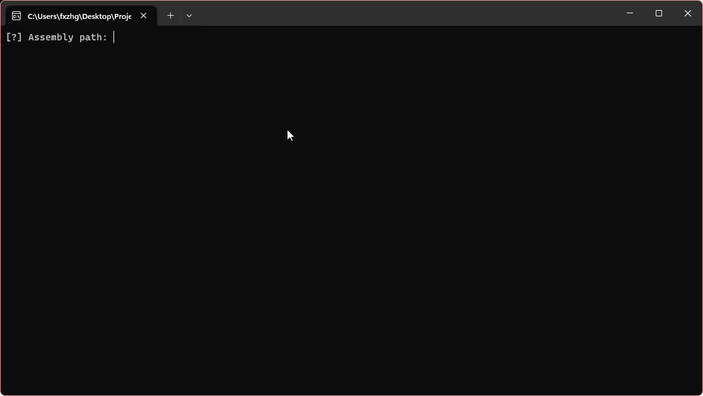

# RPCYoinker
A tool to extract rpc methods from assemblies using dnlib

[](https://github.com/angelicahvh/RPCYoinker/releases)
[](https://github.com/angelicahvh/RPCYoinker/releases)
[](https://opensource.org/licenses/MIT)

## Table of Contents
- [Preview](#preview)
- [Installation](#installation)
- [Usage](#usage)
- [License](#license)

## Preview
<p align="center">
  
</p>


## Installation
Get the latest version from the [releases](https://github.com/angelicahvh/RPCYoinker/releases/latest).

## Usage
```bash
RPCYoinker.exe <path-to-assembly> <output-directory>
```

## License
RPCYoinker is licensed under the [MIT License](https://opensource.org/licenses/MIT).
